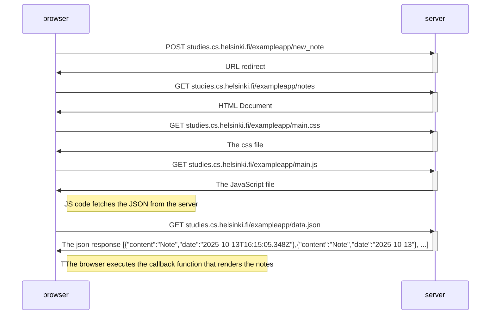

```mermaid
sequenceDiagram
    participant browser
    participant server

    browser->>server: POST studies.cs.helsinki.fi/exampleapp/new_note
    activate server
    server->>browser: URL redirect
    deactivate server
    
    browser->>server: GET studies.cs.helsinki.fi/exampleapp/notes
    activate server
    server->>browser: HTML Document
    deactivate server    

    browser->>server: GET studies.cs.helsinki.fi/exampleapp/main.css
    activate server
    server->>browser: The css file
    deactivate server

    browser->>server: GET studies.cs.helsinki.fi/exampleapp/main.js
    activate server
    server->>browser: The JavaScript file
    deactivate server
    Note right of browser: JS code fetches the JSON from the server
    
    browser->>server: GET studies.cs.helsinki.fi/exampleapp/data.json
    activate server
    server->>browser: The json response [{"content":"Note","date":"2025-10-13T16:15:05.348Z"},{"content":"Note","date":"2025-10-13"}, ...]
    deactivate server

    Note right of browser: TThe browser executes the callback function that renders the notes
```