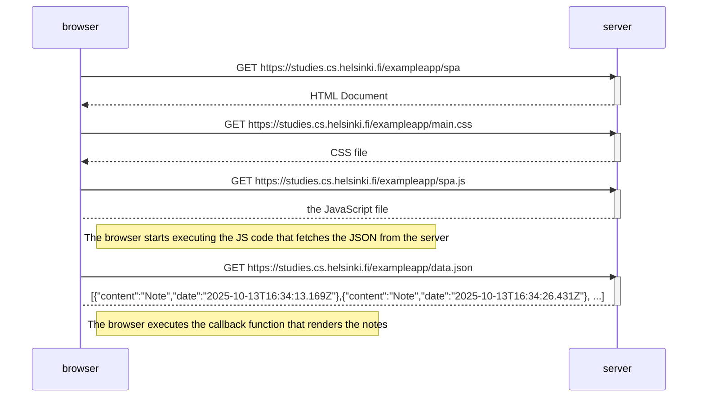

```mermaid
sequenceDiagram
    participant browser
    participant server

    browser ->> server: GET https://studies.cs.helsinki.fi/exampleapp/spa
    activate server
    server-->>browser: HTML Document
    deactivate server

    browser ->> server: GET https://studies.cs.helsinki.fi/exampleapp/main.css
    activate server
    server-->>browser: CSS file
    deactivate server

    browser ->> server: GET https://studies.cs.helsinki.fi/exampleapp/spa.js
    activate server
    server-->browser: the JavaScript file
    deactivate server
    Note right of browser: The browser starts executing the JS code that fetches the JSON from the server


    browser ->> server: GET https://studies.cs.helsinki.fi/exampleapp/data.json
    activate server
    server-->browser: [{"content":"Note","date":"2025-10-13T16:34:13.169Z"},{"content":"Note","date":"2025-10-13T16:34:26.431Z"}, ...]
    deactivate server
    Note right of browser: The browser executes the callback function that renders the notes

```